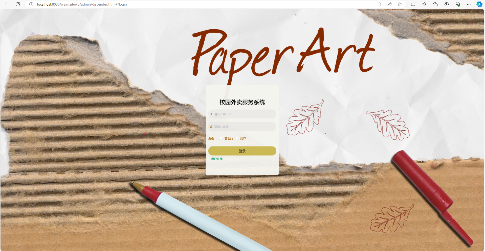
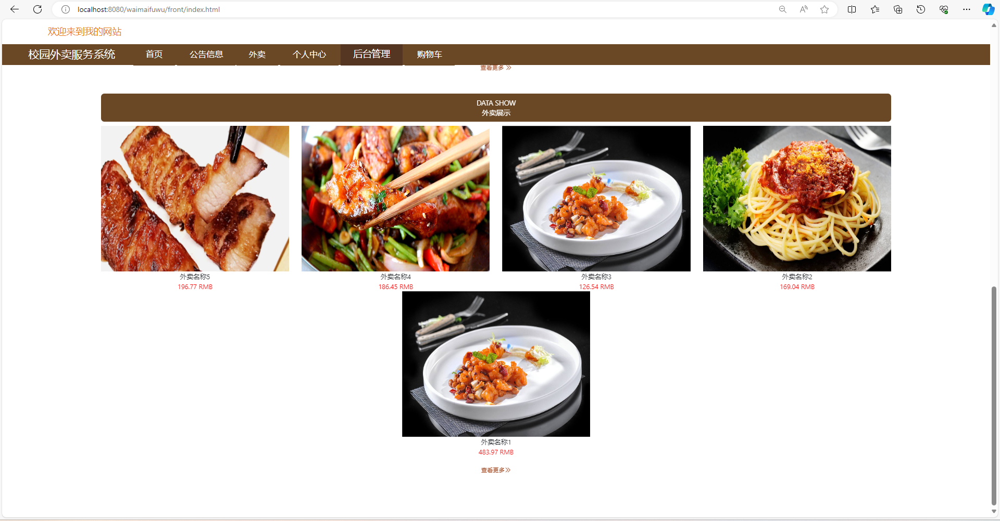
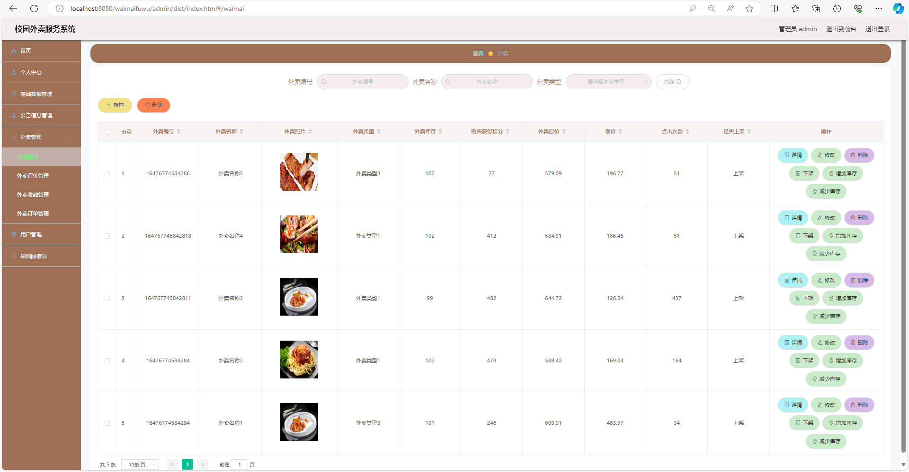
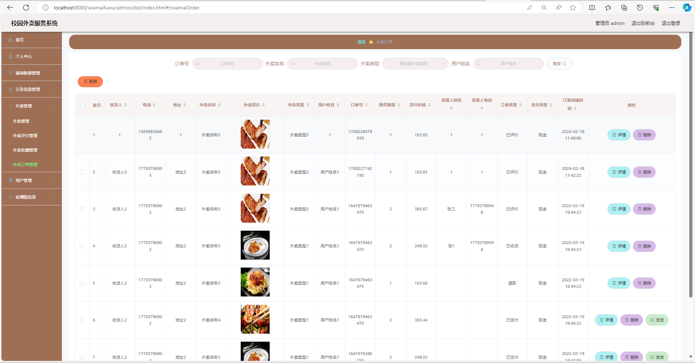
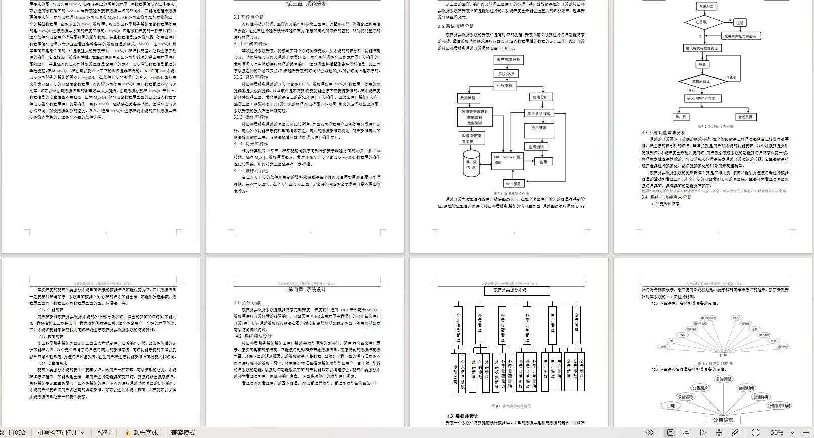

# 校园外卖服务平台带11000字项目文档

### 9.9￥ 获取完整源码+sql，附赠11000字论文参考，需要加Q：3808981644 备用Q：3577148218
### 有问题，或者需要协助调试运行项目的也可联系
### 获取更多项目，关注公众号：编程项目集

## 一、项目介绍

基于Springboot+vue的

开发语言：java

运行环境:idea或eclipse 数据库:mysql

主要技术:Springboot,mybatis,mysql,vue,html

系统角色:用户 管理员

用户功能：注册、登录、首页、公告信息、外卖菜品、购物车、个人中心、外卖收藏、外卖订单、订单评价、修改密码

管理员功能：个人中心、公告类型管理、会员等级类型管理、外卖类型管理、公告信息管理、外卖评价管理、外卖收藏管理、外卖订单管理、用户管理、轮播图管理

## 二、部分功能界面展示

## 三、万字文档参考

### 四、 9.9￥ 获取完整源码+sql，附赠11000字论文参考，需要加Q：3808981644 备用Q：3577148218
### 有问题，或者需要协助调试运行项目的也可联系

